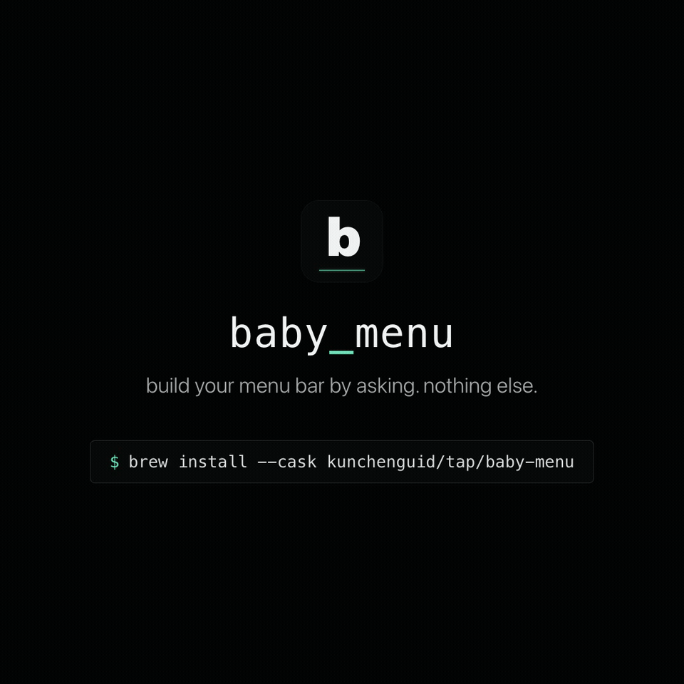

<h1 align="center">baby-menu</h1>
<p align="center">
  <a href="https://github.com/kunchenguid/baby-menu/actions/workflows/ci.yml"></a>
  <a href="https://img.shields.io/badge/platform-macOS-blue?style=flat-square"></a>
  <a href="https://img.shields.io/badge/electron-42-9feaf9?style=flat-square"></a>
  <a href="https://x.com/kunchenguid"></a>
  <a href="https://discord.gg/Wsy2NpnZDu"></a>
</p>

<h3 align="center">Adopt a baby menu and help it grow.</h3>

<p align="center">
  
</p>

Every menu-bar app ships a fixed set of widgets.
Want your CPU usage next to your Claude usage next to your next calendar event?
Good luck waiting for someone to build exactly that.

baby-menu flips it.
The popover menu can run your coding agent to edit the menu on the fly.
You ask for a feature in plain English, the agent writes an extension and it hot reloads into the menu in real time.

- **Personal self-evolving software** - jump into the future where every piece of software is personal and self-evolving towards your exact needs.
- **Ask, don't configure** - tweak the menu using natural language, not configuration.
- **Worry-free** - every agent turn can be kept or undone.

## Quick Start

Requires macOS 13 Ventura or newer, Homebrew, and a supported, already-authenticated agent CLI such as `claude` or `codex` on `PATH`.

```sh
brew install --cask kunchenguid/tap/baby-menu
open -a "Baby Menu"
```

Click the tray icon, then ask for a widget in the composer such as:

```text
add a CPU usage widget that shows current load in %
```

Baby Menu writes changes under `~/.baby-menu/extensions`, mounts updated widgets or layouts live, and shows a Keep / Undo bar only when files actually changed.
The bar labels the real diff (`Added the cpu extension`, `Updated the layout`) so you can keep or throw away each turn.

Open the popover header to reach Settings (an overlay that preserves your menu state), quit, or install an update.
Settings lets you toggle launch-at-login, pick the embedded agent, and manage custom ACP agents.

## Install Details

The packaged app stores extensions, the local database, caches, agent sessions, and preferences under `~/.baby-menu`, so upgrades preserve generated widgets and extension state.
If `~/.baby-menu/extensions` is a symlink, Baby Menu seeds bundled defaults and compiles widget or layout CSS from the resolved writable target while leaving the symlink itself in place.

Update with Homebrew:

```sh
brew update
brew upgrade --cask baby-menu
```

When a newer release exists, Baby Menu shows an update indicator in the popover header.

For agent selection, custom ACP agents, telemetry, and environment flags, see [docs/configuration.md](docs/configuration.md).

## How It Works

```
   ┌─────────────────────┐
   │  macOS tray popover │   (React renderer, adaptive size)
   │ + Menu / Settings   │
   │ + Update indicator  │
   │ + Quit              │
   └──────────┬──────────┘
              │  send()
              ▼
   ┌───────────────────────┐       ┌──────────────────────┐
   │  BabyMenuAgentRuntime ├──────►│    Change Session    │
   │   wraps acpx/runtime  │       │   git or snapshot    │
   └──────────┬────────────┘       │   by runtime mode    │
              │                    └──────────┬───────────┘
              │ edits files                   │ save / rollback
              ▼                               ▼
   ┌─────────────────────┐       ┌──────────────────────┐
   │ active extensions/  │       │   save snapshot or   │
   │  layout.tsx         │◄──────┤   rollback files     │
   │  <id>/widget.tsx    │       │   safely             │
   │  <id>/server.ts     │       │                      │
   └──────────┬──────────┘       │                      │
              │ hot-reload       └──────────────────────┘
              ▼
   ┌─────────────────────┐
   │     WidgetHost      │
   │ mounts layout/widget│
   └─────────────────────┘
```

- **Three processes, one bridge** - the renderer never touches git, the agent, or the filesystem; everything goes through `window.babyMenu`.
- **Recipes are specs, not prompts** - HTML files under `extensions/recipes/` describe a widget's capability and data sources; the agent reads the matching recipe before implementing.
- **Bundled ACP adapters** - built-in Claude Code and Codex run through clean-room adapters isolated from user-level agent configuration.
- **Diff-derived Keep / Undo** - the change bar reflects the actual git or snapshot diff, not agent wording, and clears itself when nothing changed on disk.
- **Extensions own their capabilities** - widgets, layouts, settings sections, server actions, background tasks, and a shared SQLite store, all behind the stable bridge.

For the full design notes and repository layout, see [docs/architecture.md](docs/architecture.md).

## Docs

- [docs/configuration.md](docs/configuration.md) - agent selection, custom ACP agents, telemetry, environment flags
- [docs/architecture.md](docs/architecture.md) - runtime design notes and repository layout
- [docs/development.md](docs/development.md) - building, testing, and packaging Baby Menu itself

## License

Baby Menu is released under the MIT License.
See [LICENSE](LICENSE) for details.
